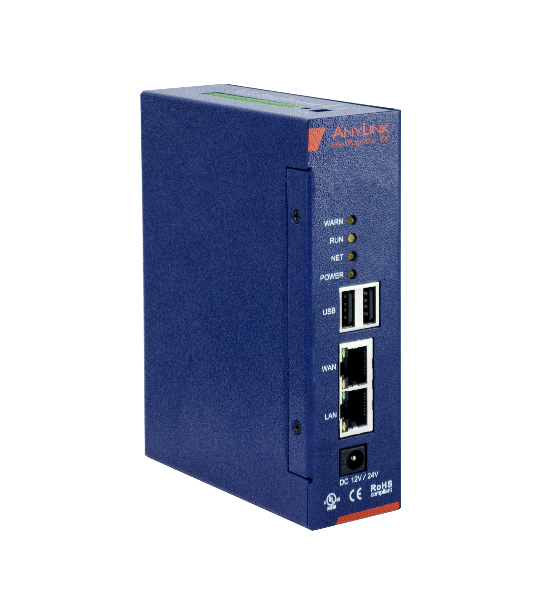
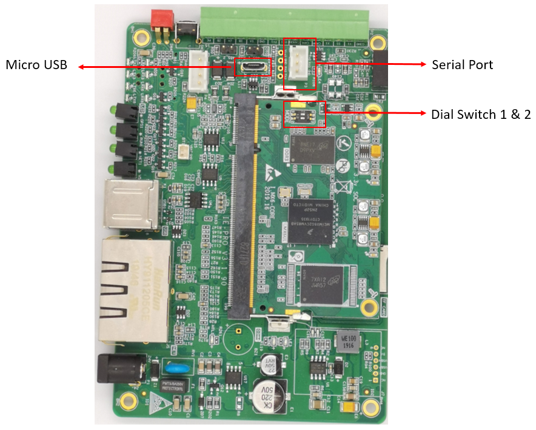
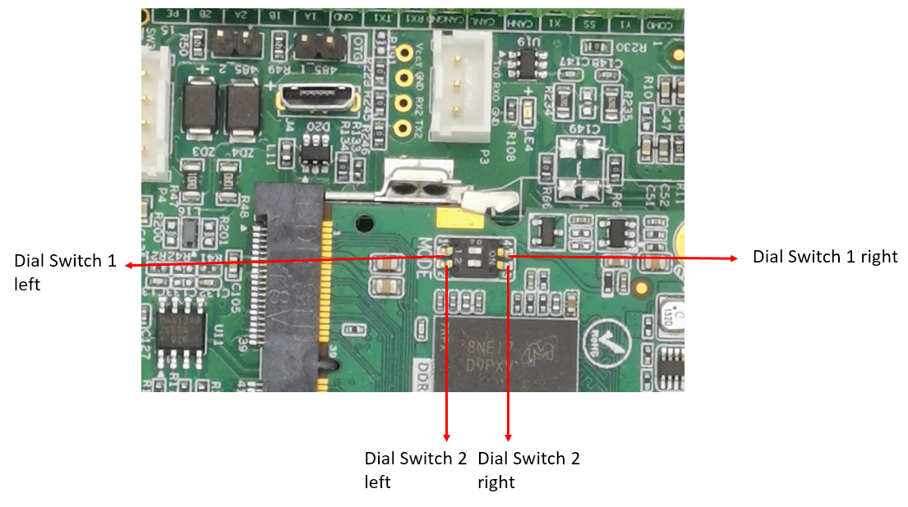
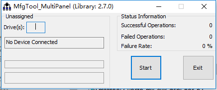

# AnyLink IE Pro IoT Box User Guide

AnyLink IE Pro is an industrial IoT box. It can be used in many IoT use cases, such as enviroment monitoring, fleet management, industrial device data aquisition and hvac remote monitoring.

The sample codes written in Python demonstrate how to manipulate the following functions:

* **ntp** - scripts/ntp.py demonstrates how to syncronize time with online NTP services.
* **reset** - scripts/reset.py shows how to use reset button to trigger customizable actions.
* **serial port** - scripts/serial.py shows how to manipulate serial port and GPIO.
* **4G connectivity** - scripts/4g.py shows how to dial 4G connection.


<p align="center">
  
</p>


## AnyLink IE Pro connectivity variants

* **AnyLink IE Pro 100** - Ethernet
* **AnyLink IE Pro 200** - Ethernet + Wi-Fi
* **AnyLink IE Pro 400** - Ethernet + 4G


## AnyLink IE Pro IoT box use cases

* labrotory environmental monitoring
* industrial device data aquisition
* fleet management
* hvac remote monitoring
* smart water management

## Intro to AnyLink IE Pro IoT box

1. Based on Debian Linux distribution which means your custom edge software can be deployed in it.
2. Supports multiple communication types: Wi-Fi, 4G, ethernet.
3. Supports multiple interfaces: RS-232, RS-485 serial port and GPIO.
4. Supports multiple runtimes: C, C++, Java, Nodejs, Python.

   
## Usage


### network configuration


You can use **nmcli** command line tool to manage network configurations.

To view all network connections, type the following command in shell:

```
nmcli con show
```

It will return the name, UUID, network type and device name of all network interfaces:

> NAME                UUID                                  TYPE      DEVICE


> Wired connection 1  d7e5c916-b2f9-4bc4-9d46-0d0569d928ab  ethernet  eth0


> Wired connection 2  56b57b82-6ee3-3111-bd17-9517e14a0eba  ethernet  --


Use the following command to modify the ip address of the ethernet interface. The [UUID] parameter can be found in the previous command):
```
nmcli con mod [UUID] ipv4.addresses xxx.xxx.xxx.xxx/24
```

And then reload the connection:

```
nmcli con reload
```
You should reboot the box to make sure the IP address modification to take effect.


### SSH connection

If you want to connect to the box with SSH client, you should make sure your computer and the box are in the same ip subnet 192.168.0.x.
Once the computer can ping the box sucefully, you can use SSH client such as Putty to connect to the box with the following parameters: 

| ssh parameter              | value         |
| ---------------------------|:-------------:|
| default LAN IP             | 192.168.0.70  |
| default SSH port           | 22            |
| ssh login user/password    | ie/anylink    |
| default root password      | pFBvMRzA      |


### Wi-Fi connection

You can use nmcli tool to scan, connect, disconnect, delete Wi-Fi connections.

| Wi-Fi operations              | command                                                |
| ------------------------------|:------------------------------------------------------:|
| scan nearby wi-fi hotspots    | ```nmcli device wifi ```                               |
| connect wi-fi hotspot         | ```nmcli d wifi connect "SSID" password "password"```  |
| disconnect wi-fi              | ```nmcli device disconnect ifname wlan0```             |
| delete wi-fi connection       | ```nmcli con delete <wifi name>```                     |


### NTP service

There are tow ways to snnchronize time with ntp server:

1. using ntplib
2. using ntpdate


#### Using ntplib to synchronize time

1. install pip
2. install ntplib
3. query ntp server


1 install pip for Python 2.7
sudo apt install python-pip


2.install ntplib Python library

	```
	pip install ntplib
	```

3. use ntplib to query ntp server

	```
	ntp_servers = ['0.cn.pool.ntp.org', '1.cn.pool.ntp.org', '2.cn.pool.ntp.org', '3.cn.pool.ntp.org']
	c = ntplib.NTPClient()
	response = c.request(server)
	ts = response.tx_time
	_date, _time = str(datetime.datetime.fromtimestamp(ts))[:22].split(' ')
	os.system('date -s "%s %s"' % (_date, _time))
	```

#### Using ntpdate library

1. install ntpdate library
	
	```
	apt install ntpdate
	```
2. syncronize time with ntp server

	```
	/usr/sbin/ntpdate -u 0.cn.pool.ntp.org
	```


### reset

The reset button and tow switches are mapped into GPIO files.

| GPIO file              	    | mapping interface  | mapping value                                  |
| ------------------------------|:------------------:|:----------------------------------------------:|
| /sys/class/gpio/gpio119/value | reset button       | value = 1: reset=OFF, value=0: reset=ON        |
| /sys/class/gpio/gpio124/value | switch 1           | value = 1: switch1=OFF, value=0: switch1=ON    |
| /sys/class/gpio/gpio121/value | switch 2           | value = 1: switch2=OFF, value=0: switch2=ON    |


Before read&write GPIO files, you should make sure that GPIO resources has been initialized.

The following commands are used to initialize the GPIO resources:
Please execute the commands with root previledge.

	```
	chmod 777 /sys/class/gpio/export
	echo 119 > /sys/class/gpio/export
	chmod 777 /sys/class/gpio/gpio119/direction
	echo in > /sys/class/gpio/gpio119/direction
	chmod 777 /sys/class/gpio/gpio119/value
	
	echo 121 > /sys/class/gpio/export
	chmod 777 /sys/class/gpio/gpio121/direction
	echo in > /sys/class/gpio/gpio121/direction
	chmod 777 /sys/class/gpio/gpio121/value
	
	echo 124 > /sys/class/gpio/export
	chmod 777 /sys/class/gpio/gpio124/direction
	echo in > /sys/class/gpio/gpio124/direction
	chmod 777 /sys/class/gpio/gpio124/value
	```

### read and write GPIO


The following table is 

| /dev name                               | function      |
| ----------------------------------------|:-------------:|
| /dev/ttymxc1                            | 485-1         |
| /dev/ttymxc2                            | 485-2         |
| /dev/ttymxc5                            | 232-1         |
| /dev/ttymxc6                            | GPS           |
| /dev/ttymxc7                            | 232-2         |
| /sys/class/gpio/gpio117/value           | input         |
| /sys/class/gpio/gpio118/value           | output        |
| /sys/class/gpio/gpio119/value           | reset         |
| /sys/class/gpio/gpio121/value           | switch 2      |
| /sys/class/gpio/gpio124/value           | switch 1      |


If you want to read&write serial port file, you should run the Python script with root previledge.
	
	```
	sudo python serial.py
	```


## AnyLink IE Pro specification

Hardware spec

| Item          | desc                                                                |
| ------------- |:-------------------------------------------------------------------:|
| CPU           | 528MHz ARM Cortex-A7                                                |
| RTC           | 1 Built-in Real Time Clock                                          |
| RAM           | 512MB DDR2 SDRAM                                                    |
| Flash         | 4GB NAND Flash                                                      |
| SD Format     | TF Card                                                             |
| GPS           | optional                                                            |
| Wireless      | Wi-Fi/4G                                                            |
| Ethernet      | 2 x 10/100M                                                         |
|IO port        | 2 x RS-485, 1 x RS-232, 2 x USB 2.0, 1 x CAN 2.0, 1 x DI, 1 x DO    |


Electrical Spec

| Item                                       | desc                                          |
| ------------------------------------------ |:---------------------------------------------:|
| Power Voltage                              | DC12V, DC24V                                  |
| Power Consumption                          | 8W                                            |
| ESD Immunity                               | Contact discharge: ± 4KV， Air discharge: 8KV | 
| Operating Voltage                          | 9～36V                                        |
| Allowable Momentary Power Interruption     | 10ms (at 12V DC)                              |

Operating Conditions

| Item                   | desc                                      |
| ---------------------- |:-----------------------------------------:|
| Relative Humidity      | 5%～95% no condensation, no freezing      |
| Operating Temperature  | -40℃～85℃                                |
| Corrosion Immunity     | Atmosphere free from corrosive gases      |
| Shock Resistance       | 10～25Hz (X Y Z Direction 2G 30 Minutes)  |


Software spec

| Item          | desc                 |
| ------------- |:--------------------:|
| OS            | Debian Jersey        |
| Kernal        | Linux  kernal 4.0    |
| Python        | 2.7                  |

Protection & Installation

| Item                      | desc                 |
| ------------------------- |:--------------------:|
| Degree of Protection      | IP51                 |
| Installation Mode         | DIN                  |
| Size                      | 135×105×38(mm)       |
| Weight                    | 600g                 |


## How to burn image for AnyLink IE Pro

Please **download** the debian image before burning it into AnyLink IE Pro:
[https://en.anylink.io/download/mfgtools-L4.4.15_2.0.0_debian.zip](https://en.anylink.io/download/mfgtools-L4.4.15_2.0.0_debian.zip "IE Pro debian image download url").


1.	Power off the box, use Micro-USB cabel to connect the box and PC.

<p align="center">
  
</p>

Switch the dial switches to make sure dial switch 1 is on the left, dial switch 2 is on the right.

<p align="center">
  
</p>


2.	Then power on the box. 
Open the image file folder, and run(double click) the following script:

    ```mfgtool2-yocto-mx-evk-emmc.vbs
	```

<p align="center">
  
</p>


After MfgTool finds the device, click Start button, it'll burn the image into the box.

3.	When burning is finished, power off the box, disconnect the Micro-USB cable. Reset two dial switches(1 on the right, 2 on the left).

4.	Connect PC with the serial port using serial port cable, then use Putty to connect the COM port. Sucessful serial port connection will indicate that the burning process suceeded.

